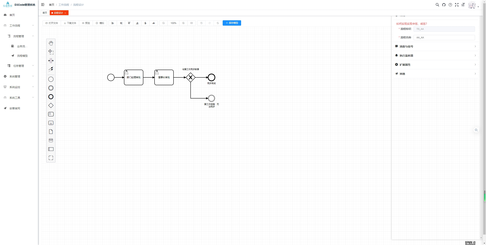
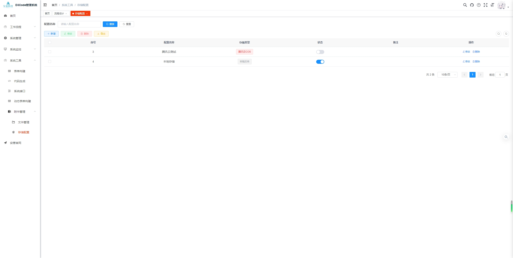
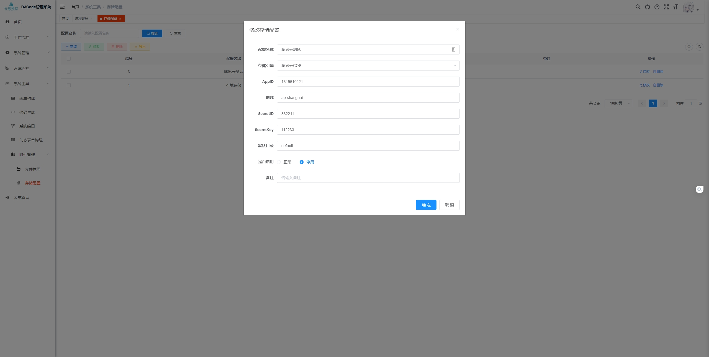
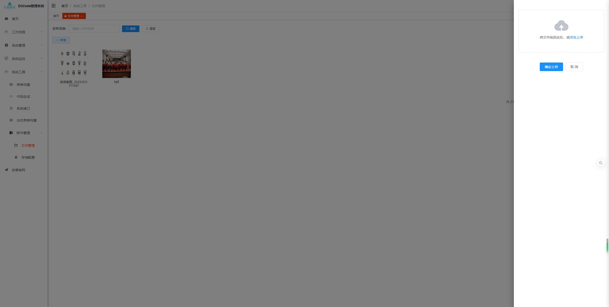
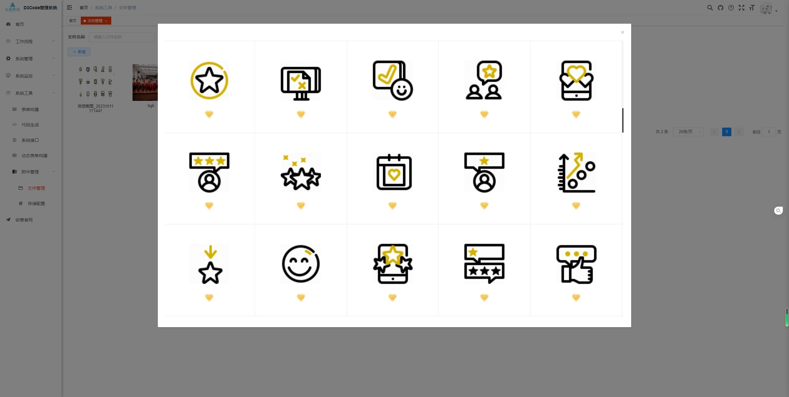
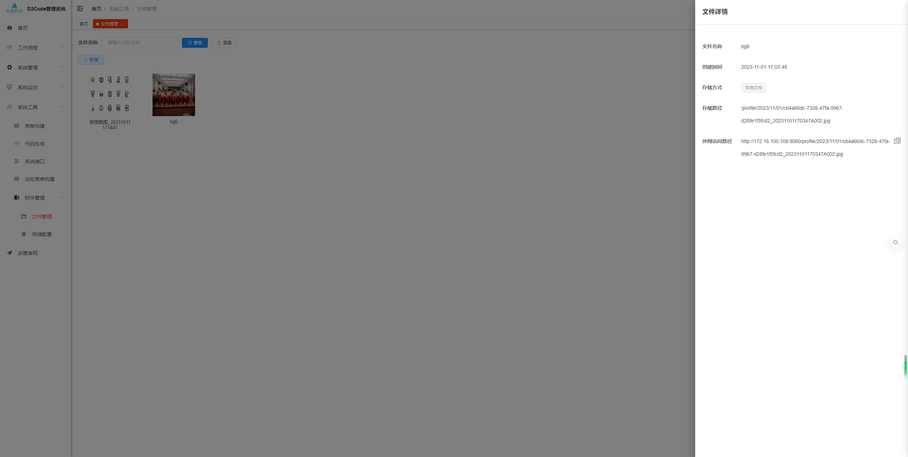

<p align="center">
	
</p>
<h1 align="center" style="margin: 30px 0 30px; font-weight: bold;">D3Code v1.0.8</h1>
<h4 align="center">基于[Ruoyi-Vue]拓展的Java快速开发框架</h4>
<p align="center">
	<a href="https://gitee.com/anhui-infomation/d3code/stargazers">
      
    </a>
	<a href="https://gitee.com/anhui-infomation/d3code">
      
    </a>
	<a href="https://gitee.com/anhui-infomation/d3code/blob/master/LICENSE">
      
    </a>
</p>

## 更新内容

1. 动态识别表主键字段
2. 允许树表自定义主键与父节点字段

## 平台简介

D3Code是基于Ruoyi-Vue拓展开发而来的框架，同Ruoyi一样是一套全部开源的快速开发平台，毫无保留给个人及企业免费使用。

前端项目地址：[d3code-ui](https://gitee.com/anhui-infomation/d3code-ui)

* 前端采用Vue、Element UI。
* 后端采用Spring Boot、Spring Security、Redis & Jwt。
* 权限认证使用Jwt，支持多终端认证系统。
* 支持加载动态权限菜单，多方式轻松权限控制。
* 高效率开发，使用代码生成器可以一键生成前后端代码。
*

## 内置功能

1. 用户管理：用户是系统操作者，该功能主要完成系统用户配置。
2. 部门管理：配置系统组织机构（公司、部门、小组），树结构展现支持数据权限。
3. 岗位管理：配置系统用户所属担任职务。
4. 菜单管理：配置系统菜单，操作权限，按钮权限标识等。
5. 角色管理：角色菜单权限分配、设置角色按机构进行数据范围权限划分。
6. 字典管理：对系统中经常使用的一些较为固定的数据进行维护。
7. 参数管理：对系统动态配置常用参数。
8. 通知公告：系统通知公告信息发布维护。
9. 操作日志：系统正常操作日志记录和查询；系统异常信息日志记录和查询。
10. 登录日志：系统登录日志记录查询包含登录异常。
11. 在线用户：当前系统中活跃用户状态监控。
12. 定时任务：在线（添加、修改、删除)任务调度包含执行结果日志。
13. 代码生成：前后端代码的生成（java、html、xml、sql）支持CRUD下载 。
14. 系统接口：根据业务代码自动生成相关的api接口文档。
15. 服务监控：监视当前系统CPU、内存、磁盘、堆栈等相关信息。
16. 缓存监控：对系统的缓存信息查询，命令统计等。
17. 在线构建器：拖动表单元素生成相应的HTML代码。
18. 连接池监视：监视当前系统数据库连接池状态，可进行分析SQL找出系统性能瓶颈。
19. 工作流管理：采用Flowable设计制作，支持使用动态表单，可用于多种不同情况下的审批流程管理

## 在线体验

- admin/admin123

演示地址：http://demo.alphay-tech.com
文档地址：http://doc.ruoyi.vip

## 开发模式

利用本框架开发项目，推荐使用Intellij Idea Idea编辑器，使用maven进行项目构建。  
必要的软件：

- JDK >= 1.8
- Redis
- MySQL >= 5.7

首先克隆项目。因d3code-ui项目为默认子模块，需要一并克隆d3code-ui项目，执行以下命令：

```bash
git clone --recurse-submodules https://gitee.com/anhui-infomation/d3code.git
```

克隆项目后，进入d3code目录，修改`d3code-admin/src/main/resources/application-dev.yml`文件中Redis与数据库配置

```yaml
  redis:
    # 地址
    host: localhost
    # 端口，默认为6379
    port: 6379
    # 密码
    password:
    # 连接超时时间
    timeout: 10000
    database: 1
    lettuce:
      pool:
        # 连接池中的最小空闲连接
        min-idle: 0
        # 连接池中的最大空闲连接
        max-idle: 8
        # 连接池的最大数据库连接数
        max-active: 8
        # #连接池最大阻塞等待时间（使用负值表示没有限制）
        max-wait: -1
  datasource:
    type: com.alibaba.druid.pool.DruidDataSource
    dynamic:
      primary: master
      strict: false
      datasource:
        # 主库数据源
        master:
          url: jdbc:mysql://localhost:3306/d3code?useUnicode=true&characterEncoding=utf8&zeroDateTimeBehavior=convertToNull&useSSL=true&serverTimezone=GMT%2B8&nullCatalogMeansCurrent=true
          username: root
          password: 123456
          driverClassName: com.mysql.cj.jdbc.Driver
        # 从库数据源
        slave:
          url:
          username:
          password:
          driverClassName: com.mysql.cj.jdbc.Driver
```

配置完成后，运行`D3CodeApplication.java`启动项目。

## 演示图

<table>
    <tr>
        <td></td>
        <td></td>
    </tr>
    <tr>
        <td></td>
        <td></td>
    </tr>
    <tr>
        <td></td>
        <td></td>
    </tr>
    <tr>
        <td></td>
        <td></td>
    </tr>

</table>

## D3Code框架交流群

QQ群： [](http://qm.qq.com/cgi-bin/qm/qr?_wv=1027&k=Un7P_Y90f6yvfX6nvsJZSnGrpuRXntUn&authKey=bRrsqhOQZ4Zed2NoT0mTNh%2FYucjHJODwc7DqIIn5MwjYwM54afy0x33NSxbYJgfD&noverify=0&group_code=908022562)
